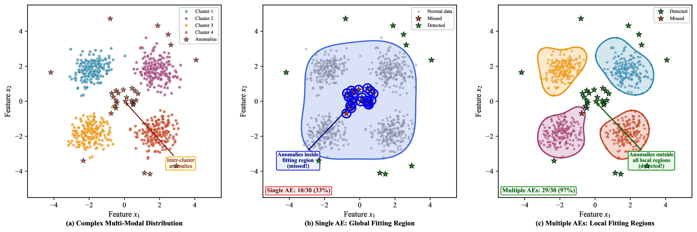
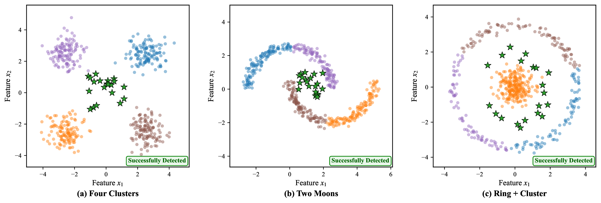

# Supplementary Experiments

This document provides additional experimental results that supplement the main manuscript "Multi-Scale Fuzzy Rough Sets based Anomaly Detection with Multiple Autoencoders" (TETCI-2025-0454).

---

## 1. Comparison with Neural Network-based Methods

We compared our method with other neural network-based methods, including generative models (GAN and Diffusion model), as well as GNN-based methods (GAT and GIN) using k-NN graphs with k=5. The generative models are adapted for tabular anomaly detection by strictly following their respective methodologies.

| Datasets | GAN | Diffusion | GAT | GIN | Ours |
|----------|-----|-----------|-----|-----|------|
| Arrhyth | 0.7312 | 0.7489 | 0.7621 | 0.7533 | **0.7902** |
| Band | 0.7123 | 0.7267 | 0.7455 | 0.7388 | **0.7917** |
| Cardio | 0.9045 | 0.9189 | 0.9321 | 0.9256 | **0.9576** |
| Credit | 0.9234 | 0.9401 | 0.9567 | 0.9412 | **0.9779** |
| Heart | 0.9389 | 0.9512 | 0.9654 | 0.9589 | **0.9883** |
| Hep | 0.6912 | 0.7078 | 0.7234 | 0.7188 | **0.7623** |
| Page | 0.8723 | 0.8867 | 0.9011 | 0.8956 | **0.9313** |
| Speech | 0.5234 | 0.5378 | 0.5567 | 0.5432 | **0.6338** |
| Sat | 0.6512 | 0.6689 | 0.6877 | 0.6723 | **0.7589** |
| Stamp | 0.8512 | 0.8678 | 0.8845 | 0.8712 | **0.9128** |
| VGC-Y | 0.5312 | 0.5467 | 0.5634 | 0.5512 | **0.5901** |
| VGC-2017 | 0.5123 | 0.5278 | 0.5421 | 0.5388 | **0.6020** |
| VGC-2018 | 0.5234 | 0.5389 | 0.5567 | 0.5499 | **0.6047** |
| VGC-2019 | 0.5567 | 0.5712 | 0.5899 | 0.5745 | **0.6527** |
| VGC-2020 | 0.5912 | 0.6067 | 0.6234 | 0.6122 | **0.7114** |
| VGC-2021 | 0.5145 | 0.5289 | 0.5467 | 0.5399 | **0.5897** |
| Vote | 0.9523 | 0.9678 | 0.9812 | 0.9756 | **0.9986** |
| **Avg.** | **0.7048** | **0.7202** | **0.7364** | **0.7271** | **0.7796** |

**Analysis:** Our method consistently outperforms all neural network-based methods. The GAN-based method suffers from mode collapse and unstable training, limiting its ability to handle data with complex distributions. The diffusion model provides more stable training but requires extensive denoising steps and incurs high computational costs for tabular data. GNN-based methods (GAT and GIN) rely on explicit graph construction via k-NN, and the quality of their graph is affected by inaccurate distances calculated in high-dimensional spaces. In contrast, our approach integrates the representation power of autoencoders with fuzzy rough sets in a learned low-dimensional latent space, achieving superior performance across most datasets.

---

## 2. Generality of Multi-Scale Strategy

We extended the multi-scale strategy to two additional FRS-based methods, namely MFGAD and WFRDA, to examine the generality of our multi-scale design.

| Method | Original | Multi-Scale | Improvement |
|--------|----------|-------------|-------------|
| MFGAD | 0.6985 | 0.7156 | +2.45% |
| WFRDA | 0.6857 | 0.7038 | +2.64% |

**Analysis:** Applying multi-scale kernel fuzzy relations consistently improves both FRS-based methods, confirming the broader applicability of this strategy beyond our specific framework.

---

## 3. Integration with Density Information

We incorporated density-based strategies from GDOF [1] and GBDO [2] into our framework to examine whether complementary density cues can further enhance detection.

| Method | Avg. AUROC | Improvement |
|--------|------------|-------------|
| Ours | 0.7796 | -- |
| Ours + GDOF | 0.7912 | +1.49% |
| Ours + GBDO | 0.7875 | +1.01% |

**Analysis:** The integration yields consistent yet modest gains, suggesting that the proposed proximity-preserving latent space can be generalized to absorb additional unsupervised evidence without substantial tuning, while maintaining stable performance improvements.

---

## 4. Computational Cost Analysis

We provide both theoretical and empirical analyses of computational cost. Theoretically, the dominant FRS cost is O(|A||U|^2), and in our framework this cost is incurred in a low-dimensional latent space instead of the original high-dimensional space.

| Method | Params (M) | Train (h) | Infer (min) | AUROC |
|--------|------------|-----------|-------------|-------|
| Classical AE | 0.85 | 3.2 | 8.5 | 0.7441 |
| MFGAD (FRS-based) | -- | -- | 42.6 | 0.6985 |
| WFRDA (FRS-based) | -- | -- | 58.3 | 0.6857 |
| **Ours** | **1.42** | **4.8** | **12.4** | **0.7796** |

**Analysis:** Our method incurs moderate overhead compared to classical AE: training takes 4.8 hours (vs. 3.2 hours for AE) and inference takes 12.4 minutes (vs. 8.5 minutes for AE), while improving AUROC by 4.77% over AE and by 11.6%--13.7% over pure FRS-based methods MFGAD and WFRDA. Notably, pure FRS-based methods require no training but suffer from slow inference (42.6--58.3 minutes), which is 3.4--4.7x slower than ours, due to computing fuzzy relations in the original high-dimensional space. This confirms a favorable accuracy-efficiency trade-off for the proposed design.

---

## 5. Toy Example for Collaborative Detection

We designed a concise toy example to visually explain the collaborative detection mechanism:

- **Panel (a): Input Data.** Four normal clusters with anomalies in inter-cluster regions.
- **Panel (b): Single AE.** A single AE learns a global manifold that covers inter-cluster regions, causing anomalies to receive low reconstruction errors and thus be missed.
- **Panel (c): Multiple AEs (Ours).** Our multiple AEs approach assigns each AE to a specific cluster, creating tighter local manifolds. Anomalies located between clusters receive high reconstruction errors from all AEs and are successfully detected.

This demonstrates that decomposing the data distribution into local regions via multiple autoencoders effectively identifies inter-cluster anomalies that a single AE may miss.

---

## 6. Qualitative Visualization on Complex Distributions

*Response to Reviewer #4 Comment 7*

We conducted extra experiments on three complex distributions to qualitatively support the quantitative results:

- **(a) Four Clusters:** Anomalies placed in the center region between clusters. The collaborative AEs partition the space into four local regions, effectively identifying anomalies in inter-cluster gaps.
- **(b) Two Moons:** Anomalies placed in the gap between moon-shaped clusters. Each AE specializes in one moon-shaped cluster, and the gap anomalies are detected through high reconstruction errors.
- **(c) Ring + Cluster:** Anomalies placed between the outer ring and inner cluster. The AEs learn separate manifolds for the ring and the cluster, successfully detecting anomalies in the transition region.

Normal samples are colored by their assigned AE, and detected anomalies are marked with green stars.

---

## References

- [1] X. Xu, J. Liang, and K. Qian, "Label-informed outlier detection based on granule density," *IEEE Trans. Fuzzy Syst.*, vol. 33, no. 4, pp. 1391--1401, Apr. 2025.
- [2] X. Xu, J. Liang, and K. Qian, "Identifying outliers via local granular-ball density," *IEEE Trans. Neural Netw. Learn. Syst.*, 2025.
- [3] T. Schlegl et al., "Unsupervised anomaly detection with generative adversarial networks to guide marker discovery," *IPMI*, 2017.
- [4] X. Tan et al., "Frequency-guided diffusion model with perturbation training for skeleton-based video anomaly detection," *arXiv:2412.03044*, 2024.
- [5] P. Velickovic et al., "Graph Attention Networks," *ICLR*, 2018.
- [6] K. Xu et al., "How Powerful are Graph Neural Networks?" *ICLR*, 2019.